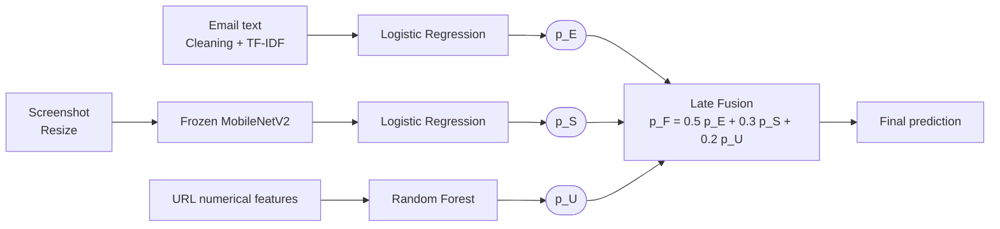

# Multimodal AI-Based Phishing Detection

**Using Email Text, Webpage Screenshots, and URL Features**

## Abstract

A phishing attack can come as a fake email, a fake webpage, or a suspicious link. This project builds a lightweight multimodal phishing detection system that uses all three sources of evidence:

- **Email text** is represented with TF-IDF and classified with Logistic Regression.
- **Webpage screenshots** are passed through a frozen MobileNetV2 to extract features, which are classified with Logistic Regression.
- **URL features** are classified with a Random Forest.

Each model outputs a phishing probability, and the three probabilities are combined by late fusion. The project also includes explainability, feature ablation, hyperparameter tuning, and cross-dataset validation.

**Keywords:** phishing detection, multimodal learning, TF-IDF, Random Forest, MobileNetV2, late fusion, explainable AI

## Introduction

A phishing attack often relies on several kinds of deception at once. The URL may have unusual attributes, the link may redirect to a fake site, and an email may carry a malicious link. This project studies these three modalities independently and then merges their predictions. The goal is a practical, CPU-efficient system built from simple machine-learning techniques.

## Pipeline



## Datasets

All datasets are public.

| Modality | Dataset | Details |
| --- | --- | --- |
| Email | CEAS 08 | Balanced subset of 9,000 emails (4,500 legitimate, 4,500 phishing) |
| URL | Pre-extracted URL feature dataset | 11,430 records, 87 numerical features (after pre-processing) |
| Screenshot | Webpage screenshot dataset | 1,697 images; balanced subset of 1,150 (600 legitimate, 550 phishing) |

Each dataset was split into stratified train, validation, and test sets.

## Methodology

### Email Classification

- The subject line and body were cleaned and converted to TF-IDF features (top 20,000 features, unigrams and bigrams).
- Logistic Regression was chosen for its strong performance and low compute cost.

### Screenshot Classification

- Images were resized to 160x160.
- A pretrained MobileNetV2, used as a frozen feature extractor, produced 1280-dimensional representations.
- Logistic Regression was trained on these features.

### URL Classification

- The dataset already contains numerical features.
- Logistic Regression and Random Forest were compared on the validation set, and Random Forest performed better.
- Hyperparameters were then tuned with `GridSearchCV`.

### Late Fusion

The three public datasets share no common identifier, so real email-screenshot-URL pairs are not available. Each modality was therefore trained independently, and a synthetic class-matched validation/test set was built for the fusion experiment. The fusion weights were chosen on the validation set:

```
p_F = 0.5 * p_E + 0.3 * p_S + 0.2 * p_U
```

where `p_E`, `p_S`, and `p_U` are the phishing probabilities from the email, screenshot, and URL models. Because the fusion set is synthetic, its results should not be read as performance on true paired multimodal attacks.

## Additional Analyses

- **Hyperparameter tuning:** applied to all three modality models.
- **Feature analysis:** feature importance and a feature-level ablation study on the URL model.
- **Explainability:** TF-IDF term importance for emails, Grad-CAM for screenshots, and SHAP (Shapley values) for URL features.
- **External validation:** the models were tested on datasets they were not trained on (Enron for email, PhiUSIIL for URL, Phish-IRIS for screenshots) to check for distribution shift.
- **Error analysis:** review of misclassified emails, URLs, and screenshots.

## Literature Review

- **Li et al. (2019):** a stacking model using URL and HTML features for phishing webpage detection, which supports using structured webpage and URL evidence.
- **Al-Subaiey et al. (2024):** an interpretable, explainable phishing-email detection platform, which motivated text-based detection with explainability.
- **Vulfin et al. (2026):** a multimodal phishing website detection system using explainable AI and late fusion, which directly inspired the probability-fusion idea used here.

This project uses simpler, CPU-friendly models and combines email, screenshot, and URL evidence in one pipeline.

## Limitations

- No shared identifiers exist across the three datasets, so fusion could not be tested on true paired multimodal samples.
- The screenshot dataset is small.
- External validation showed distribution shift, so strong in-dataset performance does not guarantee equal performance on new data.
- The system does not run on live URLs.

## Conclusion and Future Work

This project delivers a practical, lightweight multimodal phishing detection pipeline. Models built on email text and URL features performed well, and the main room for improvement is screenshot classification.

Future work:

- Collect genuine paired multimodal phishing data.
- Use a larger screenshot dataset.
- Try a more powerful language model and vision model.
- Use dynamic fusion weights instead of fixed ones.
- Add temporal and adversarial validation to test robustness against novel attacks.


## References

1. Y. Li, Z. Yang, X. Chen, H. Yuan, and W. Liu, "A stacking model using URL and HTML features for phishing webpage detection," *Future Generation Computer Systems*, vol. 94, pp. 27-39, 2019.
2. A. Al-Subaiey, M. Al-Thani, N. A. Alam, K. F. Antora, A. Khandakar, and S. A. U. Zaman, "Novel Interpretable and Robust Web-based AI Platform for Phishing Email Detection," *Computers and Electrical Engineering*, vol. 120, 109625, 2024.
3. A. Vulfin, A. Sulavko, V. Vasiliev, A. Minko, A. Kirillova, and A. Samotuga, "A Multimodal Phishing Website Detection System Using Explainable AI Technologies," *Machine Learning and Knowledge Extraction*, vol. 8, no. 1, p. 11, 2026.
